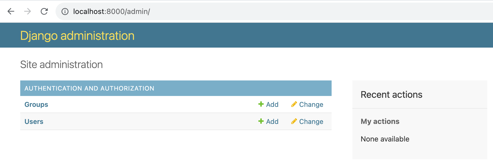
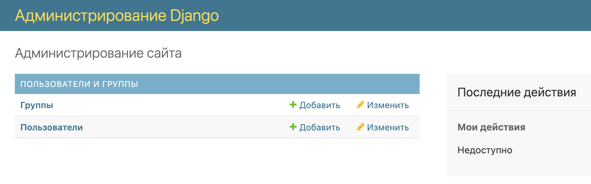
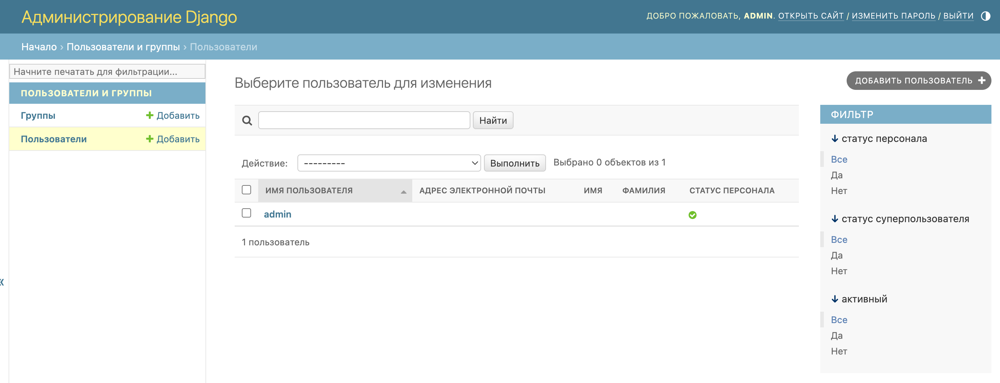

## Административная панель Django

Встроенная административная панель Django поддерживает управление пользователями, включая создание, редактирование и просмотр профилей пользователей.

Чтобы подключиться к встроенной административной панели Django, выполните следующие шаги:

1. **Применение миграций:**
    
    Выполните миграции для создания необходимых таблиц в базе данных:
    
    ```bash
    python manage.py migrate
    
    ```
    
    Это позволит создать базу данных, где будут храниться пользователи. 
    
2. **Создание суперпользователя:**
    
    Создайте суперпользователя, следуя инструкциям в консоли:
    Введите имя пользователя, адрес электронной почты и пароль для суперпользователя.
    
    ```bash
    python manage.py createsuperuser
    
    ```
    
3. **Запуск сервера разработки:**
    
    Запустите сервер разработки Django:
    
    ```bash
    python manage.py runserver
    
    ```
    
    Перейдите в браузере по адресу `http://127.0.0.1:8000/admin/` и введите данные суперпользователя, которого вы создали.
    

Теперь вы можете управлять пользователями в разделе Users.



### Локализация административная панель Django

**Локализация административной панели Django** - это процесс адаптации текстов и интерфейса административной панели Django для поддержки различных языков и региональных настроек. Локализация позволяет предоставить пользователю интерфейс на его родном языке, что улучшает пользовательский опыт и облегчает взаимодействие с приложением.

Локализация административной панели может быть настроена в файле `settings.py` вашего проекта. Вы можете заменить значение переменной `LANGUAGE_CODE`, чтобы изменить язык, который будет использоваться в административной панели. 

```python
# settings.py

...
LANGUAGE_CODE = 'ru-ru'  # Локализация на русском языке
```



И можно будет увидеть созданного вами суперпользователя


