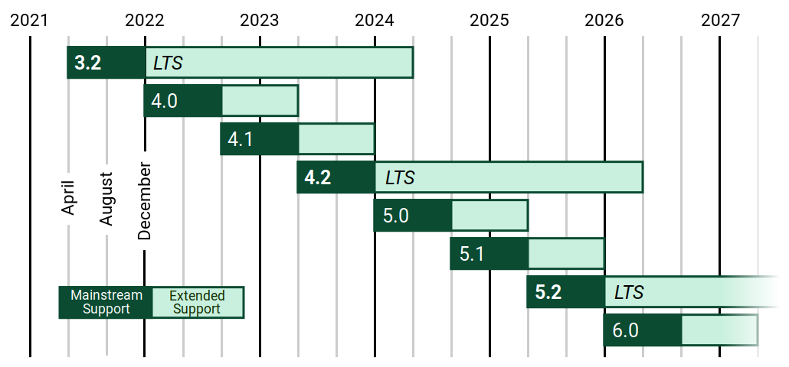

# ****Установка Django и настройка проекта****

## Версии Django

Прежде чем установить Django, важно знать о существующих версиях фреймворка. Django имеет несколько версий, и разработчики могут выбирать ту, которая наилучшим образом соответствует их потребностям. На момент написания этого учебного материала актуальной версией Django была версия 4.x.

Кроме того, стоит упомянуть о понятии **LTS (Long-Term Support)** версии Django. LTS-версия - это версия фреймворка, для которой обеспечивается длительная поддержка и обновления в течение длительного времени (обычно 3 года и более). Это означает, что разработчики могут использовать LTS-версию для создания стабильных и долгосрочных проектов, не беспокоясь о частых изменениях и обновлениях.

LTS-версия Django важна для коммерческих и критических проектов, которые требуют стабильности и надежности. Например, версия 3.2 LTS прекратит свою поддержку в апреле 2024 года, а версия 4.2 LTS в апреле 2026. 



## Как установить фреймворк Django

Для установки Django воспользуемся утилитой pip, выполните следующие шаги:

1. **Откройте командную строку (терминал)**: Для начала установки Django вам потребуется доступ к командной строке вашей операционной системы.
2. **Установите Django с помощью pip**: В командной строке выполните следующую команду:
    
    ```bash
    pip install Django==4.2.5
    
    ```
    
    Это установит версию Django 4.2.5. Указание версии полезно, если вам необходимо явно установить конкретную стабильную версию фреймворка.
    
3. **Проверьте установку Django**: После завершения установки, вы можете проверить, что Django установлен правильно, выполнив следующую команду в командной строке:
    
    ```bash
    django-admin --version
    
    ```
    
    `django-admin` это утилита командной строки Django, которая используется для выполнения различных задач связанных с Django-проектами. Указав `--version` вы можете получить текущую установленную версию Django. Если установка прошла успешно, вы увидите номер версии Django в выводе команды.
    
    ```
    4.2.5
    ```
    
    Теперь у вас установлена нужная версия Django, и вы готовы начать создание своего веб-приложения.
    

## Команда для создания нового Django проекта

Рассмотрим процесс создания нового проекта с использованием фреймворка Django. Django предоставляет удобные инструменты для создания проектов, которые включают в себя необходимую структуру файлов и папок, а также автоматически создают несколько базовых файлов и настроек.

Для создания нового проекта в Django, вы можете использовать команду `django-admin startproject projectname`, где `projectname` - это имя вашего проекта. Эта команда создаст каталог с именем вашего проекта и разместит внутри него несколько важных файлов и подкаталогов, необходимых для работы с Django.

Пример создания проекта с именем "myproject":

```bash
django-admin startproject myproject .

```

Команда `django-admin startproject myproject .` выполняет следующие действия:

1. `django-admin`: Это утилита командной строки Django, которая используется для выполнения различных задач связанных с Django-проектами.
2. `startproject`: Это одна из команд `django-admin`, предназначенная для создания нового проекта Django. Когда вы выполняете `startproject`, вы указываете его за именем команды, чтобы создать новый проект.
3. `myproject`: Это имя вашего нового проекта. Вы можете выбрать любое имя для вашего проекта, и оно будет использоваться как имя каталога, в котором будет создан проект, а также как имя Python-пакета для вашего проекта.
4. `.`: Этот необязательный аргумент указывает текущую директорию, в которой будет создан проект. 

Когда вы используете `.` в качестве аргумента, проект будет создан в текущей рабочей директории. Это бывает полезно, когда вы хотите создать Django-проект в уже существующей директории отведённой под проект. 

Давайте рассмотрим оба варианта:

1. `django-admin startproject myproject` (без точки в конце):

```
current_dir/  <- текущая директория
    myproject/  <- проект создается в отдельной поддиректории с именем "myproject"
        manage.py
        myproject/
            __init__.py
            asgi.py
            settings.py
            urls.py
            wsgi.py

```

1. `django-admin startproject myproject .` (с точкой в конце):

```
current_dir/  <- текущая директория
    __init__.py
    asgi.py
    manage.py
    myproject/
        __init__.py
        settings.py
        urls.py
        wsgi.py

```

В первом варианте (без точки в конце) проект создается в отдельной поддиректории с именем "myproject". Таким образом, вся структура проекта находится внутри этой поддиректории, и внешний каталог (тот, в котором была выполнена команда) остается чистым. Во втором варианте (с точкой в конце) проект создается в текущем каталоге, где была выполнена команда. Это означает, что файлы и каталоги проекта размещаются непосредственно в текущем каталоге, а не в поддиректории. Оба варианта создадут ту же базовую структуру проекта Django, но разница в том, где будет размещена эта структура относительно вашей текущей директории.

# Запуск локального сервера для разработки

Рассмотрим процесс запуска локального сервера для разработки веб-приложения на фреймворке Django. Локальный сервер играет ключевую роль в разработке, поскольку он позволяет разработчикам тестировать и отлаживать свое приложение на локальной машине.

## Что такое локальный сервер для разработки и зачем он нужен

Локальный сервер для разработки (также известный как разработческий сервер) - это специальный веб-сервер, который используется во время разработки веб-приложений. Его цель - обеспечить разработчикам удобную среду для проверки и отладки своего кода без необходимости развертывания приложения на удаленном сервере.

Локальный сервер нужен для:

- **Быстрая обратная связь**: Разработчики могут мгновенно видеть результаты своей работы и легко отслеживать ошибки и проблемы в коде приложения, не загружая код на удаленный сервер.
- **Изоляция**: Локальный сервер работает в изолированной среде, что позволяет избегать конфликтов с другими приложениями и серверами. Например, если нужный порт для вашего веб-приложения занят, вы с лёгкостью можете указать любой доступный порт.

## Как запустить локальный сервер для разработки веб-приложения

Для запуска локального сервера для разработки веб-приложения на Django, вы можете использовать следующую команду:

```bash
python manage.py runserver

```

- `python` - это команда для запуска Python-скриптов.
- `manage.py` - это управляющий скрипт Django, который находится в корневой директории вашего проекта.
- `runserver` - это команда, которая запускает локальный сервер разработки.

После выполнения этой команды, локальный сервер начнет работу и будет слушать определенный порт (по умолчанию 8000). Вы увидите вывод в командной строке, который сообщит вам о запуске сервера.

```
Watching for file changes with StatReloader
Performing system checks...

System check identified no issues (0 silenced).

You have 18 unapplied migration(s). Your project may not work properly until you apply the migrations for app(s): admin, auth, contenttypes, sessions.
Run 'python manage.py migrate' to apply them.
September 08, 2023 - 15:46:43
Django version 4.2.5, using settings 'myproject.settings'
Starting development server at http://127.0.0.1:8000/
Quit the server with CONTROL-C.
```

1. "Watching for file changes with StatReloader": Это сообщение о том, что Django запустил мониторинг файлов для отслеживания изменений в коде вашего проекта. Если файлы проекта будут изменены, Django автоматически перезагрузит сервер, чтобы применить эти изменения.
2. "Performing system checks...": Django выполняет системные проверки, чтобы убедиться, что все настройки и зависимости настроены правильно и проект готов к запуску.
3. "System check identified no issues (0 silenced).": Это сообщение говорит о том, что системные проверки прошли успешно и не обнаружено никаких проблем. Число в скобках (0) указывает на количество предупреждений, которые были подавлены и не отображены.
4. "You have 18 unapplied migration(s). Your project may not work properly until you apply the migrations for app(s): admin, auth, contenttypes, sessions. Run 'python [manage.py](http://manage.py/) migrate' to apply them.": Это информация о наличии 18 непримененных миграций в вашей базе данных. Миграции - это способ управления структурой базы данных.
5. "September 08, 2023 - 15:46:43": Это дата и время, когда сервер был запущен.
6. "Django version 4.2.5, using settings 'myproject.settings'": Сообщение указывает на версию Django, которую вы используете, и имя файла настроек вашего проекта (в данном случае 'myproject.settings').
7. "Starting development server at http://127.0.0.1:8000/": Это сообщение о том, что сервер разработки Django успешно запущен и слушает запросы на адресе http://127.0.0.1:8000/.
8. "Quit the server with CONTROL-C.": Это подсказка, как завершить работу сервера. Для остановки сервера можно использовать комбинацию клавиш CONTROL-C в командной строке.

Этот текст полезен для отслеживания состояния и запуска Django-приложения в процессе разработки.

## Проверка работоспособности сервера в веб-браузере

Чтобы проверить, что локальный сервер работает корректно, вы можете открыть веб-браузер и ввести следующий URL: `http://127.0.0.1:8000/`

Этот URL указывает на локальный сервер на вашей машине и порт 8000, на котором работает сервер по умолчанию. Если сервер запущен успешно, вы увидите страницу приветствия Django, которая подтверждает, что ваше веб-приложение работает.

Локальный сервер будет автоматически обрабатывать HTTP-запросы к вашему приложению и предоставлять вам доступ к разрабатываемому веб-сайту для проверки и отладки.

Запуск локального сервера является первым шагом в разработке веб-приложения на Django, и он позволяет вам начать создание и тестирование вашего приложения.