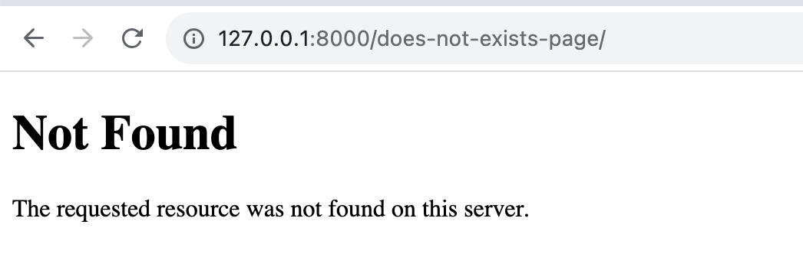

# Вызов ошибки 404 в Django

## Обработка ошибки 404 в Django

Ошибка 404 - это часть стандартной системы обработки ошибок в веб-приложениях. Она возникает, когда клиент (обычно веб-браузер) запрашивает ресурс, который не существует на сервере. Это может быть вызвано опечаткой в URL-адресе или запросом к несуществующей странице.

### Какая роль у ошибки 404 в веб-приложениях?

Роль ошибки 404 заключается в информировании пользователя о том, что запрашиваемый им ресурс не найден. Это важно для улучшения пользовательского опыта, так как пользователи должны знать, почему им был отказан доступ к какой-либо странице. Вместо того, чтобы видеть просто пустую страницу с сообщением об ошибке, пользователи получают информативное сообщение об ошибке 404.

### Как Django обрабатывает ошибку 404 по умолчанию?

Django имеет встроенную систему обработки ошибок, включая ошибку 404. По умолчанию Django отображает стандартную страницу 404 с сообщением о том, что страница не найдена.


> You’re seeing this error because you have DEBUG = True in your Django settings file. Change that to False, and Django will display a standard 404 page.
> 

Это сообщение означает, что вы видите данную ошибку, потому что в настройках Django у вас установлен параметр **`DEBUG = True`**. Это значение **`True`** активирует режим отладки, который отображает подробную информацию об ошибках на веб-странице при возникновении ошибки, что может быть полезно во время разработки приложения.

Однако, для более безопасной эксплуатации вашего веб-приложения, особенно в производственном окружении, рекомендуется изменить значение параметра **`DEBUG`** на **`False`**. Когда **`DEBUG`** установлен в **`False`**, Django будет отображать стандартную страницу ошибки 404 (страницу "Не найдено") для пользователей, вместо подробной информации об ошибке. Это уменьшает риск разглашения чувствительных данных и помогает защитить ваше приложение от потенциальных атак.

Когда отключен режим отладки, ваше приложение перестаёт принимать запросы от хостов, которые не указаны в `ALLOWED_HOSTS`.  Установка `ALLOWED_HOSTS` значения `["*"]` означает, что ваше приложение принимает запросы от любого хоста (домена). В производственном окружении это нежелательно и даже небезопасно, так как оно делает ваше приложение уязвимым к атакам. Оба эти параметра (`DEBUG` и `ALLOWED_HOSTS`) важны для правильной настройки вашего веб-приложения в производственном окружении и обеспечения его безопасности и стабильности.

```python
# В settings.py
DEBUG = False  # Переключение в режим "продакшн" выключает отладочный режим

ALLOWED_HOSTS = ["*"]  # Принимать запросы от всех хостов

```

После этих настроек можно увидеть ошибку 404, которую будут видеть пользователи вашего приложения. 



## Создание представления для вызова ошибки 404

Ошибки 404 - неотъемлемая часть разработки веб-приложений, и иногда вам может потребоваться явно вызвать ошибку 404 в Django. Это может быть полезным, например, при проверке условий и проверке существования определенных ресурсов. В этом уроке мы рассмотрим, как создать представление, которое вызывает ошибку 404, и приведем примеры использования этого механизма.

### Как создать представление, которое вызывает ошибку 404

В Django для вызова ошибки 404 вы можете использовать исключение `Http404` из модуля `django.http`. Для этого вам потребуется импортировать `Http404` и использовать его в вашем представлении.

Пример создания представления, которое вызывает ошибку 404:

```python
# views.py
from django.http import Http404

def custom_404_view(request):
    # Проверяем условие, при котором нужно вызвать ошибку 404
    if not some_condition:
        raise Http404("Страница не найдена")

    # Ваш код обработки запроса
    # ...

```

```python
# urls.py
...

from . import views

urlpatterns = [
		...,
    path("does-not-exists-page/", views.custom_404_view)  # Добавляем представление, которое будет возвращать ошибку 404
]
```

В приведенном примере, если условие `some_condition` не выполняется, то вызывается исключение `Http404` с сообщением "Страница не найдена". При этом Django автоматически обрабатывает это и перенаправляет пользователя на страницу 404.


В данном случае URL, который обрабатывается, есть, но всё равно возвращается ошибка 404, это потому, что так настроена логика самого представления. В реальных сценариях вызов ошибки 404 полезен, если вы разрабатываете представление для просмотра деталей объекта (например, подробного описания отдельного пункта из списка дел), вы можете вызвать ошибку 404, если запрашиваемый объект не существует.