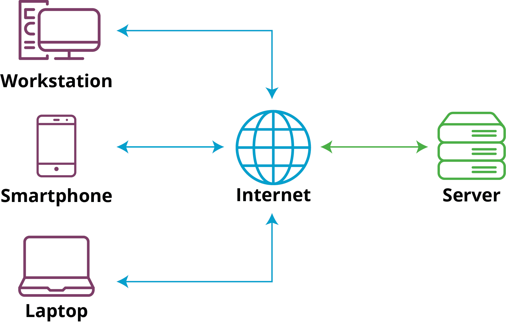

# ****Клиент-серверная архитектура****

## Цель урока

После завершения этого урока вы поймете, как устроена клиент-серверная архитектура, как взаимодействуют клиентские и серверные компоненты, и каким образом это применяется в веб-разработке.

## Клиент-серверная архитектура

Клиент-серверная архитектура - это распределенная система, где компьютеры (или устройства) разделяются на два типа: клиенты и серверы. Клиенты - это устройства или программы, которые обращаются к серверам за определенными ресурсами или услугами. Серверы - это устройства или программы, предоставляющие ресурсы или услуги клиентам.

### **Протокол HTTP**

**Протокол** - это согласованный набор правил и инструкций, которые определяют способ взаимодействия между различными устройствами или программами. В контексте компьютерных сетей, протоколы определяют, как данные должны передаваться и интерпретироваться.

**Протокол HTTP** (Hypertext Transfer Protocol) - это протокол передачи гипертекста, который используется для передачи данных между клиентами и серверами в сети. Гипертекст означает, что документы могут содержать ссылки (гиперссылки) на другие документы, которые могут быть загружены или просмотрены пользователем.

### **Зачем нужен протокол HTTP?**

Протокол HTTP нужен для того, чтобы компьютеры могли обмениваться информацией через интернет. Это как язык, на котором они могут понимать друг друга, когда передают данные.

Вот пример: когда вы переходите на веб-сайт, ваш браузер (например, Chrome или Firefox) использует HTTP для запроса страницы у сервера, на котором хранится сайт. Сервер отвечает, отправляя вашему браузеру нужную информацию, и браузер отображает страницу.

Протокол HTTP помогает компьютерам общаться в интернете, чтобы вы могли просматривать веб-сайты, отправлять сообщения и делать много других вещей онлайн.

### **Процесс взаимодействия**

Давайте представим, что вы сидите за компьютером и хотите найти информацию о погоде в вашем городе. Вы открываете свой интернет-браузер, вводите в адресной строке адрес веб-сайта поисковой системы и нажимаете "Enter". Как происходит взаимодействие между вами (как клиентом) и веб-сайтом поисковой системы (как сервером)?

1. Вы вводите адрес веб-сайта поисковой системы в адресной строке браузера и нажимаете "Enter". Это действие инициирует отправку HTTP запроса.
2. Ваш браузер создает HTTP запрос, который включает в себя ваш запрос о погоде. Затем он отправляет этот запрос на сервер поисковой системы.
3. Веб-сервер поисковой системы получает ваш запрос. Он анализирует его и ищет соответствующую информацию о погоде в вашем городе.
4. Веб-сервер формирует HTTP ответ, который включает в себя запрошенные данные о погоде. Он отправляет этот ответ обратно в ваш браузер.
5. Ваш браузер получает HTTP ответ от веб-сервера. Он интерпретирует ответ, форматирует данные о погоде и отображает их на экране.