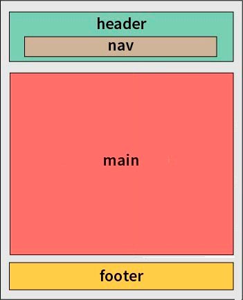

## **Цель задания:**

Вы научитесь организовывать контент веб-страницы, а также применять стили к элементам страницы с помощью встроенных CSS стилей.

### Организация контента

При создании веб-страницы важно следовать семантической разметке, которая делает структуру страницы понятной для браузеров, поисковых систем и разработчиков. В этом контексте использование специальных тегов, таких как `<header>`, `<nav>`, `<main>` и `<footer>`, имеет свою значимость. 



1. `<header>`: Этот тег предназначен для размещения заголовочной части страницы, которую ещё называют “шапкой ”. В нем обычно размещается логотип, название сайта, слоган и другие элементы, которые являются общими для всей страницы или раздела. Использование `<header>` позволяет создать одинаковую облегчает стилизацию.
2. `<nav>`: Тег `<nav>` используется для обозначения навигационного меню, позволяющего посетителям перемещаться по сайту. В нем обычно размещаются ссылки на разделы сайта, внутренние страницы, категории и т.д.
3. `<main>`: Тег `<main>` предназначен для содержания основного контента страницы. В нем обычно размещается самая важная информация, которую посетитель ожидает найти на данной странице.
4. `<footer>`: Этот тег используется для размещения подвала страницы. В нем обычно размещаются контактные данные, ссылки на социальные сети, авторские права.

Семантическая разметка с помощью этих тегов не только помогает браузерам и поисковым системам лучше понимать структуру страницы, но и облегчает ее стилизацию, обеспечивает логичную иерархию элементов на странице.

### Уникальный стиль

Стили в HTML — это как магия, которая придает веб-страницам визуальную гармонию и уникальность. Представьте, что каждая страница — это холст, а стили — волшебные краски, которые обрамляют заголовки, разукрашивают тексты и выгодно подчеркивают элементы. Они дают возможность воплотить дизайнерские идеи, сделать сайт узнаваемым, а самое главное — оставить впечатление, которое будет притягивать пользователей обратно. **CSS (Cascading Style Sheets)** — это язык, который используется для стилизации и оформления веб-страниц. 

Что, ещё один язык? Не волнуйтесь, работать со стилями, это задача отдельных специалистов - верстальщиков. Верстальщики – это специалисты, занимающиеся созданием веб-страниц на основе дизайнерских макетов. Их задача заключается в переводе графического дизайна в код HTML и CSS. Они создают структуру и внешний вид веб-сайта, обеспечивая правильное расположение элементов, цветовые схемы, типографику и другие визуальные аспекты.

Иногда бэкенд разработчикам всё же приходится работать с HTML и CSS, с CSS в меньшей степени. 

### Зачем нужны CSS стили

1. **Разделение структуры и стиля:** CSS позволяет отделить оформление страницы от её структуры и содержания. Это делает код более читаемым и облегчает его редактирование.
2. **Единый стиль:** С помощью CSS можно применить одинаковый стиль ко всем страницам сайта, что создает единое визуальное восприятие и узнаваемость.
3. **Удобство и гибкость:** CSS позволяет быстро и легко изменять внешний вид страницы, не затрагивая её структуру. Это облегчает поддержку и адаптацию сайта под разные устройства.

### Как писать стили

1. **Выбор элементов:** Чтобы стилизовать элементы HTML, вы должны сначала выбрать их. Это делается с помощью селекторов. **Селекторы** — это часть CSS-правила, которая определяет, к каким элементам на веб-странице будут применены стили. Селекторы могут быть именами тегов, классами, идентификаторами и так далее.
2. **Определение стилей:** После выбора элементов, вы определяете стили, которые хотите применить. Стили включают такие свойства, как цвет текста, фон, размер шрифта, внутренний и внешний отступы, и многие другие.

Вот некоторые примеры селекторов и их использования:

1. **Элементный селектор.** 
    
    Элементный селектор в CSS выбирает все элементы определенного типа и применяет к ним стили. Например, элементный селектор для тега **`<p>`** (абзаца) будет применять стили ко всем абзацам на странице. 
    
    ```css
    p {
        font-size: 16px;
        line-height: 1.5;
        margin-bottom: 10px;
    }
    
    ```
    
    В этом примере:
    
    - `p` - это селектор, который выбирает все элементы `p` на странице.
    - `font-size: 16px;` устанавливает размер шрифта для абзацев на 16 пикселей.
    - `line-height: 1.5;` устанавливает межстрочный интервал на 1.5, что обеспечивает хорошую читаемость текста.
    - `margin-bottom: 10px;` добавляет нижний отступ (пространство между абзацами) в 10 пикселей.
2. **Классовый селектор.** 
    
    Классовый селектор в CSS выбирает элементы, которые имеют определенный класс. Это позволяет вам применять стили к конкретным элементам, которые имеют этот класс. Атрибут `class` в HTML используется для присвоения одного или нескольких классов элементам страницы.
    
    **HTML:**
    
    ```html
    <div class="container">
        <!-- Содержимое контейнера -->
    </div>
    
    <div class="container text-container">
        <!-- Другой контент с двумя классами -->
    </div>
    
    ```
    
    **CSS:**
    
    ```css
    .container {
        ...
    }
    
    .text-container {
        ...
    }
    
    ```
    
    Первому `<div>` элементу применяется класс `.container`. Ко второму `<div>` элементу применятся классы `.container` и `.text-container`.
    

Это не весь перечень свойств и селекторов, которые доступ в CSS. Но этого хватит, чтобы читать и разбирать стили и при необходимости что-то подкрутить в уже существующем коде. 

## Как подключить CSS стили

Для того чтобы подключить файл стилей CSS к веб-странице, используется элемент `<link>`. Этот элемент размещается в секции `<head>` HTML документа и указывает браузеру, где найти файл со стилями. Вот как это делается:

```html
<!DOCTYPE html>
<html>
<head>
    <!-- Прочие заголовки -->
    <link rel="stylesheet" type="text/css" href="styles.css">
</head>
<body>
    <!-- Содержимое веб-страницы -->
</body>
</html>

```

В данном примере:

- `<link>` – это элемент, который связывает веб-страницу с внешними ресурсами, в данном случае с файлом стилей.
- `rel="stylesheet"` – атрибут, указывающий на тип связи между веб-страницей и подключаемым файлом (стилем).
- `type="text/css"` – атрибут, определяющий тип файла, который будет подключен.
- `href="styles.css"` – атрибут, содержащий относительный или абсолютный путь к файлу стилей. Здесь `"styles.css"` предполагается, что это имя файла стилей, находящегося в той же директории, что и сам HTML-файл.

Таким образом, подключение стилей с помощью отдельного файла позволяет отделить структуру и внешний вид страницы, что является одним из ключевых принципов современного веб-дизайна.

## Задание "Оформление веб-сайта с использованием CSS"

Ваш новый веб-сайт уже почти готов, но чтобы он выглядел привлекательно и структурировано, вам понадобится добавить стили CSS.

Для успешного выполнения задания, следуйте этим шагам:

1. **Подключение файлов со стилями:**
В папке `css` уже есть готовый файл со стилями, который нужно применить к вашим веб-страницам. Верстальщики постарались для вас, даже не поленились оставить комментарии, то такое бывает не всегда. В каждом HTML-файле, расположенном в корневой папке проекта, вам нужно подключить файл `styles.css` в раздел `<head>`. 
2. **Актуализация навигационной панели:**
В файле "index.html" в верхней части вашей страницы есть навигационная панель с неактивными ссылками. Вам нужно заменить "#" в атрибуте "href" каждой ссылки на следующие рабочие ссылки:
    - "Главная" - это текущая страница "index.html".
    - "Основы HTML" - ссылка на ресурс: [Основы HTML](https://developer.mozilla.org/ru/docs/Learn/Getting_started_with_the_web/HTML_basics)
    - "Основы CSS" - ссылка на ресурс: [Основы CSS](https://developer.mozilla.org/ru/docs/Learn/Getting_started_with_the_web/CSS_basics)
3. **Перенос шапки и подвала:**
В файле "index.html" у вас уже есть готовые шапка и подвал. Вам нужно перенести их на другие веб-страницы вашего сайта. Просто скопируйте код шапки из "index.html" и вставьте его в начало каждой веб-страницы. То же самое сделайте для кода подвала, вставьте его в конец каждой веб-страницы.
4. **Применение классов к элементам:**
Добавьте классы к элементам `div`. Все теги `<div>` должны иметь класс `container`. А на страницах кроме `index.html` внутри `main` они должны иметь ещё класс `text-container`.

После завершения всех шагов, перезагрузите ваши веб-страницы в браузере, и вы увидите, как ваш веб-сайт стал более структурированным и привлекательным благодаря добавленным стилям. Теперь у вас есть визуально привлекательный сайт, который готов радовать глаза ваших посетителей!