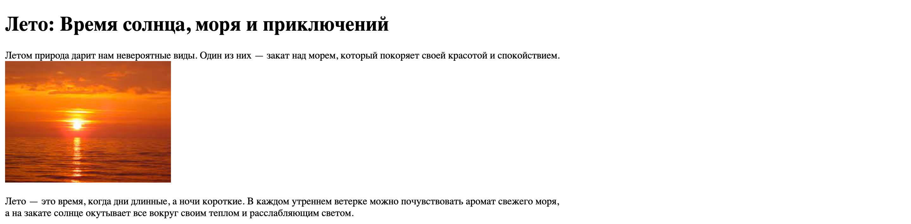

# **Теги и атрибуты**

## **Цель задания:**

После завершения этого урока вы научитесь использовать HTML теги для создания структуры веб-страниц. 

## **Классификация HTML тегов**

Вы уже знаете как записываются HTML теги, давайте теперь подробнее разберем какие они бывают. 

Не все HTML теги одинаково устроены, некоторые имеют атрибуты. **Атрибуты HTML тегов** - это дополнительные параметры, которые можно добавлять к HTML тегам для того, чтобы уточнить или изменить их поведение, стиль или свойства. Атрибуты указываются в открывающем теге, обычно после имени тега, и они предоставляют дополнительную информацию о том, как следует отображать или обрабатывать содержимое элемента.

Ещё теги могут быть разделены на два основных типа: одиночные и парные.

### Одиночные теги

**Одиночные теги** - это теги, которые не имеют закрывающего тега. Они служат для вставки элементов, которые не имеют контента или не требуют дополнительных вложенных элементов.

1. `` - Один из самых часто используемых одиночных тегов, используется для вставки изображений на веб-страницу.
    
    В теге `` атрибуты `src` и `alt` являются ключевыми для определения и отображения изображения на веб-странице:
    
    **Атрибут `src` (Source):** Этот атрибут указывает путь к изображению, которое следует отобразить на странице. Значение атрибута `src` может быть относительным или абсолютным URL-адресом до изображения на сервере. Браузер использует значение атрибута `src`, чтобы загрузить изображение и вставить его внутрь тега ``. Пример:
    
    ```html
    
    
    ```
    
    **Атрибут `alt` (Alternative Text):** Этот атрибут предоставляет текстовое описание изображения. Если изображение по какой-либо причине не может быть отображено (например, из-за недоступности файла или ошибки загрузки), текст из атрибута `alt` будет отображен вместо изображения. Это также полезно для пользователей с ограниченными возможностями, которые используют программы чтения с экрана. Пример:
    
    ```html
    
    
    ```
    
    Значение атрибута `alt` следует выбирать таким образом, чтобы оно описывало содержание изображения и его контекст на странице.
    
2. `<br>` - Этот тег создает перенос строки, полезный, например, для разделения текста на несколько строк. HTML текст игнорирует символы переноса текста, и поэтому нужно использовать тег `<br>`, чтобы отобразить текст на новой строке. 
    
    Пример: 
    
    ```html
    Первая строка<br>
    Вторая строка
    ```
    

### Парные теги

**Парные теги** - это теги, которые состоят из открывающего и закрывающего элементов. Они обрамляют содержимое, которое будет отображаться на веб-странице. Примером парного тега может быть `<p>`, который используется для создания параграфов текста. Открывающий тег `<p>` указывает начало параграфа, а закрывающий тег `</p>` - его конец. Между этими тегами будет располагаться текст или другие элементы разметки.

1. `<p>` - Тег для создания абзацев текста. Пример: `<p>Это абзац текста.</p>`.
2. `<a>` - Используется для создания гиперссылок.
    
    В теге `<a>` атрибут `href` используется для определения адреса, на который переходит пользователь при клике на текст или изображение, обернутые этим тегом.
    
    Когда пользователь щелкает на элементе с тегом `<a>`, браузер перенаправляет его на URL, указанный в атрибуте `href`. Этот URL может быть как относительным путем к локальной странице, так и полным внешним адресом, ведущим к другой веб-странице, файлу или ресурсу в Интернете.
    
    Примеры использования атрибута `href`:
    
    1. Относительный URL для локальных страниц:
        
        ```html
        <a href="about.html">О нас</a>
        
        ```
        
        В данном случае, при клике на текст "О нас", пользователь будет перенаправлен на локальную страницу `about.html` на том же сайте.
        
    2. Полный URL для внешних ресурсов:
        
        ```html
        <a href="<https://www.example.com>">Пример</a>
        
        ```
        
        При клике на текст "Пример" пользователь перейдет по указанному полному адресу `https://www.example.com`.
        
3. `<ul>` и `<li>` - Совместно используются для создания неупорядоченных списков. `<ul>` - это контейнер для списка, а `<li>` - элементы списка. Пример:
    
    ```html
    <ul>
      <li>Первый пункт</li>
      <li>Второй пункт</li>
    </ul>
    ```
    
4. Тег `<div>` является одним из самых распространенных и важных элементов в HTML. Он не имеет особого семантического значения, но служит как контейнер для группировки и структурирования других элементов и контента на веб-странице.

Эти теги представляют лишь малую часть разнообразных элементов разметки, доступных в HTML.

## Задание:

Есть заготовленный HTML документ *summer.html,* который нужно завершить. Откройте документ в браузере и сравните его с тем, как он должен выглядеть на странице:


1. Создайте заголовок первого уровня для текста “Лето: Время солнца, моря и приключений”
2. Внутри первого параграфа, используется тег ``, для отображения картинки. Вместо неё отображается альтернативный текст, так как картинка находится не рядом с файлом *summer.html,* а папке *images*. Исправьте значение атрибута `src`, чтобы путь до картинки был верным. 
3. Картинка должна располагаться на отдельной строке, поэтому её нужно перенести с помощью тега `<br>`. 
4. В последнем параграфе используйте тег `<br>`, чтобы разделить предложения о времени года на строки. Перенос строки должен быть во втором предложении после запятой. 
5. Cгрупируйте заголовок первого уровня и два параграфа в один блок `div`. 
