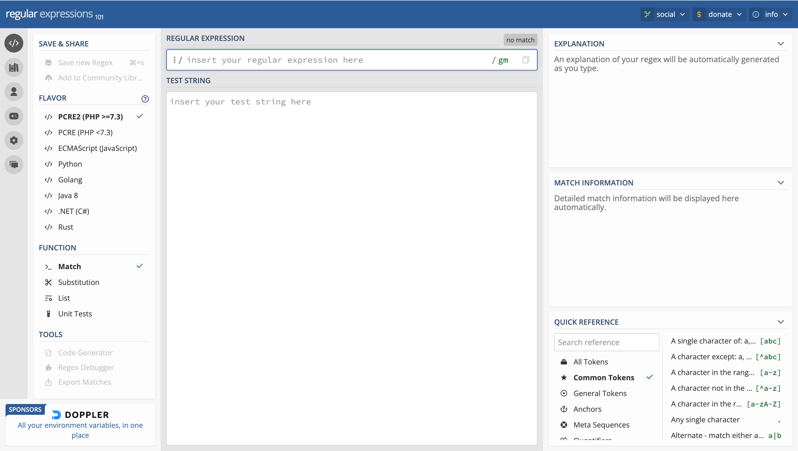

## Что такое регулярные выражения?

### Определение понятия регулярных выражений

Регулярные выражения, часто называемые просто "регулярками", представляют собой мощный инструмент для работы с текстовой информацией. Они используются для поиска, сопоставления и обработки текста с учетом заданных шаблонов. Регулярные выражения позволяют создавать гибкие правила для поиска и манипулирования текстом, что делает их неотъемлемой частью многих программ и скриптов, работающих с данными.

### Роль регулярных выражений в обработке текста

Регулярные выражения играют важную роль в обработке текстовой информации. Они позволяют:

1. Поиск текста: С помощью регулярных выражений можно находить строки, соответствующие определенным шаблонам, что полезно при поиске ключевых слов, адресов электронной почты, ссылок и других элементов текста.
2. Сопоставление данных: Регулярные выражения позволяют проверять, соответствует ли текст заданным критериям, например, является ли строка числом, адресом или датой.
3. Извлечение информации: С использованием регулярных выражений можно извлекать определенные фрагменты текста, такие как номера телефонов, имена, даты и другие данные.
4. Замена текста: Регулярные выражения позволяют заменять одни части текста на другие в соответствии с заданными правилами. Это полезно при очистке и преобразовании данных.
5. Валидация данных: Регулярные выражения используются для проверки правильности формата данных, таких как адреса электронной почты, номера телефонов или пароли.

Регулярные выражения предоставляют мощный инструмент для обработки текстовой информации и могут значительно упростить задачи, связанные с анализом и манипулированием текстом в различных программных средах, включая Python.

## Синтаксис и основы регулярных выражений

Регулярные выражения включают в себя разнообразные элементы синтаксиса, которые позволяют создавать шаблоны для поиска и обработки текста. Давайте рассмотрим основные концепции и элементы синтаксиса регулярных выражений:

### Символы и группы символов

1. **Символы:** Буквенные символы в регулярных выражениях обозначают сами себя. 
    
    Например, `a` соответствует символу "a", `1` соответствует цифре "1".
    
2. **Группы символов:** Вы можете создавать группы символов с использованием квадратных скобок.  
    
    Например, `[aяуюоеёэиы]` соответствует любой гласной букве. 
    
    Группы могут также содержать диапазоны, например, `[a-z]` соответствует любой строчной букве от "a" до "z". А вот с диапазоном русских букв есть нюанс, в диапазон `[а-я]` не попадёт буква "ё", её нужно будет указать отдельно: `[а-яё]`. 
    
    Если в начале группы символов стоит символ `^`, то это будет означать любой символ, кроме тех, что указаны в списке. Например, `[^aяуюоеёэиы]` будет соответствовать любому символу отличному от гласных букв.
    

### Специальные символы и их экранирование

1. **Специальные символы:** Регулярные выражения содержат специальные символы, такие как `.` (точка) или `?` (вопросительный знак), которые имеют специальные значения в контексте регулярных выражений. Например, `.` соответствует любому символу, `?` означает, что символ может быть, а может и не быть. 
    
    Перечень спецсимволов: `.` `^` `$` `*` `+` `?` `{` `}` `[` `]` `\` `|` `(` `)`
    
2. **Экранирование:** Если вам нужно сопоставить один из специальных символов как обычный символ, вы можете использовать обратный слеш `\`. Например, `\.`, `\?`, и так далее.

### Токены

1. **Токены:** Токены включают в себя специальные символы и буквенные символы, которые представляют конкретные сущности в тексте. Например, `\d` соответствует цифре, `\w` - буквенно-цифровому символу, `\s` - пробельному символу.
2. **Инверсия:** Иногда можно инвертировать токены, используя верхний регистр. Например, `\D` соответствует всему, кроме цифр, `\W` - всему, кроме буквенно-цифровых символов, и так далее.

Часто употребляемые группы символов были выделены в отдельные объекты **токены**:

- `\s` – любой пробельный символ (пробел, перенос строки, таб и т.д.),эквивалентно `[ \f\n\r\t\v]`
- `\S` – любой НЕ пробельный символ, эквивалентно `[^ \f\n\r\t\v]`
- `\d` – любая цифра, эквивалентно `[0-9]`
- `\D` – любая не цифра, эквивалентно `[^0-9]`
- `\w` – любой символ, относящийся к слову (буква, число, подчеркивание),эквивалентно `[a-zA-Z0-9_]`
- `\W` – любой не относящийся к слову символ, эквивалентно `[^a-zA-Z0-9_]`
- `.` – любой один символ (вообще любой)

### Якоря и границы слов

1. **Якоря:** Якоря - это специальные символы, которые обозначают положение в тексте. Например, `^` обозначает начало строки, а `$` - конец строки.
2. **Границы слов:** Границы слов можно определить с помощью `\b`. Например, `\bword\b` соответствует только слову "word" как отдельной группе символов, и не будет совпадать с "words" или "keyword".

### Примеры:

1. `\b[А-ЯЁ][а-яё][а-яё][а-яё][а-яё]\b`:
    
    Это регулярное выражение предназначено для поиска слов в русском тексте, которые состоят из пяти букв и начинаются с заглавной буквы (буквы верхнего регистра), а затем следуют четыре строчные буквы (буквы нижнего регистра).
    
2. `^\+7 \(\d\d\d\) \d\d\d-\d\d-\d\d$`:
    
    Это регулярное выражение предназначено валидации всей строки на соответствие определенному формату телефонного номера. Конкретно, оно ищет строки, которые начинаются с "+7", за которыми следует пробел, затем открывающаяся круглая скобка "(", за которой идут три цифры, затем закрывающаяся круглая скобка ")", после чего идут еще пробел, а затем шесть групп из трех цифр, разделенных дефисами. Этот шаблон соответствует российскому телефонному номеру в формате "+7 (XXX) XXX-XX-XX", где "X" - это цифры.
    
3. `\d\d:\d\d:\d\d`:
    
    Это регулярное выражение используется для поиска строк, соответствующих формату времени в формате "часы:минуты:секунды". Конкретно, оно ищет строки, в которых две цифры (0-9) следуют за двоеточием (":") и повторяются три раза подряд. Этот шаблон соответствует временному формату HH:MM:SS, где HH - часы (от 00 до 23), MM - минуты (от 00 до 59), и SS - секунды (от 00 до 59).
    

## Работа с регулярными выражениями на сайте regex101

Для более удобного и интерактивного изучения и тестирования регулярных выражений вы можете использовать онлайн-ресурс regex101. Этот ресурс предоставляет множество инструментов и функций для работы с регулярными выражениями. Давайте рассмотрим, как использовать regex101 и проведем практические примеры работы с регулярными выражениями.

### Ознакомление с онлайн-ресурсом regex101

1. **Посещение сайта regex101:** Откройте браузер и перейдите на сайт [regex101.com](https://regex101.com/).
2. **Интерфейс regex101:** Изучите интерфейс сайта. Вы увидите поля для ввода текста и регулярного выражения, а также панель с различными вкладками и инструментами.



1. **Выбор флагов:** В верхней части сайта, вы можете выбрать флаги для регулярного выражения. Флаги определяют опции сопоставления, такие как регистрозависимость и многое другое.
2. **Ввод текста:** Введите текст, с которым вы хотите работать, в поле "Текст для проверки".
3. **Ввод регулярного выражения:** Введите ваше регулярное выражение в поле "Регулярное выражение".
4. **Анализ совпадений:** После ввода текста и регулярного выражения, сайт regex101 проанализирует текст и покажет все совпадения, если они есть. Они будут выделены в тексте.
5. **Панель с результатами:** Слева от текста, вы найдете панель с результатами анализа. Здесь вы можете увидеть совпадения, группы совпадений и другую информацию.
6. **Краткий справочник:** Вы можете вносить изменения в регулярное выражение и видеть, как они влияют на результаты. Это позволяет проводить интерактивное тестирование регулярных выражений.

### Практические примеры

Давайте рассмотрим практический пример работы с регулярными выражениями на сайте regex101. 

Задание состоит в поиске и извлечении дат в формате "год-месяц-день" (`YYYY-MM-DD`) из текстовых данных. Формат даты "год-месяц-день" очень распространен и используется в различных сферах, включая запись дат в базах данных, журналах, документах и т. д. Он представляет собой числовой формат, где:

- "год" представляет собой четыре цифры, обозначающие год (например, 2023).
- "месяц" представляет собой две цифры, обозначающие месяц (например, 09 для сентября).
- "день" также представляет собой две цифры, обозначающие день месяца (например, 05).

Задача включает в себя использование регулярных выражений для поиска и извлечения данных, соответствующих этому формату. Регулярные выражения позволяют создать шаблон, который будет соответствовать строкам, содержащим даты в указанном формате. Как только даты будут найдены, они могут быть использованы для дальнейшей обработки, анализа или сохранения в базе данных.

Используя следующее регулярное выражение проанализируйте результаты, которые выдаст сайт regex101 на данных, которые там есть - https://regex101.com/r/0vvsM3/4

```
\b\d\d\d\d-\d\d-\d\d\b
```

Регулярное выражение `\b\d\d\d\d-\d\d-d\d\b` предназначено для поиска строк, соответствующих формату даты в виде "год-месяц-день". Давайте разберем, как это выражение работает:

- `\b`: Это граница слова, которая обозначает начало или конец слова. В данном случае она используется, чтобы обеспечить точное совпадение с форматом даты, а не с подстроками.
- `\d\d\d\d`: Этот фрагмент соответствует четырем цифрам подряд. Это предполагает, что первые четыре цифры должны представлять год.
- `-`: Это обычный символ дефиса, который используется для разделения года, месяца и дня.
- `\d\d`: Эти два фрагмента соответствуют двум цифрам подряд. Первые две цифры после дефиса предполагается, что они представляют месяц.
- `-`: Еще один дефис, который разделяет месяц и день.
- `\d\d`: Эти две цифры представляют день месяца.
- `\b`: Завершающая граница слова, обозначающая конец формата даты.

Теперь давайте рассмотрим, какие данные она найдет из предоставленного текста и почему:

- "Сегодняшняя дата: 2023-09-05" - Регулярное выражение найдет "2023-09-05", так как это соответствует формату "год-месяц-день".
- "05 сентября 2023 года" - Регулярное выражение не найдет совпадений, так как в этой фразе дата указана в формате "день месяц год", а не "год-месяц-день" и месяц указан не числом, а текстом.
- "Дата: 05.09.23" - Регулярное выражение не найдет совпадений, так как это также соответствует формату "день.месяц.год".
- "2023/09/05" - Регулярное выражение не найдет совпадений, так как здесь дата указана в формате "год/месяц/день".
- "2023-09-05T10:45:00Z" - Регулярное выражение не найдет совпадений, так как здесь дата указана в формате ISO 8601, и дата в ней является подстрокой, а регулярное выражение настроено, чтобы искать отдельные даты.