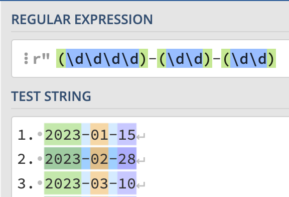
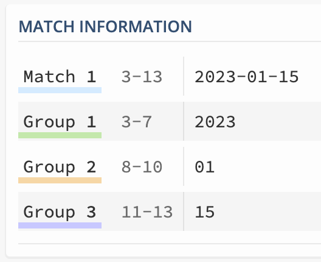
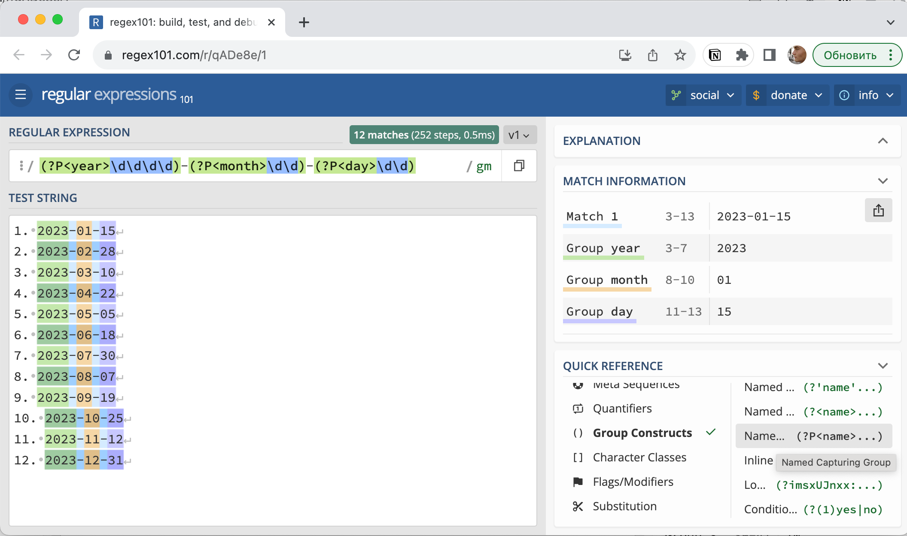
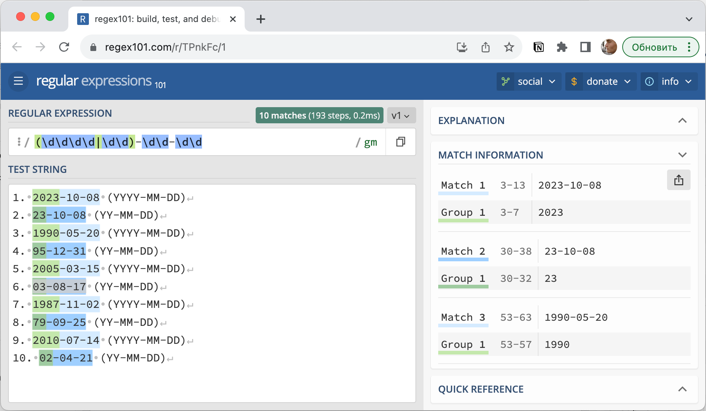
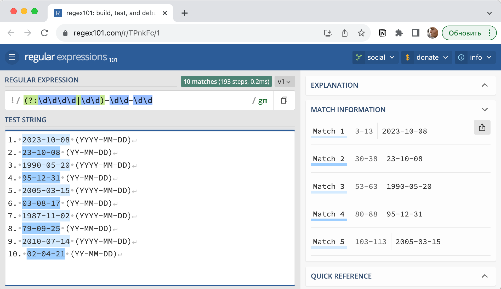

## Скобочные группы

### Что такое скобочные группы?

**Скобочные группы** - это одна из ключевых концепций в регулярных выражениях. Они представляют собой механизм для определения и группировки подстрок в тексте, которые соответствуют определенным шаблонам. С помощью скобочных групп можно добиться более точного поиска и извлечения информации из текстовых данных.

Зачем нужны скобочные группы при работе с регулярными выражениями? Они выполняют несколько важных задач:

1. **Группировка** — cкобочные группы позволяют объединять символы внутри них в логические блоки. Это удобно для создания более сложных шаблонов и повторяющихся структур.
2. **Захват данных** — cкобочные группы позволяют "захватывать" (или извлекать) подстроки из текста, которые соответствуют шаблону группы. Захваченные данные можно затем использовать в дальнейшей обработке или анализе.
3. **Повторение —** cкобочные группы можно повторять, указывая количество повторений или диапазон. Это полезно при поиске или сопоставлении текста, содержащего множество подобных элементов.
4. Альтернативы — cкобочные группы в регулярных выражениях можно использовать для создания альтернатив, что означает "или" при наличии нескольких значений в группе.

### Группировка и з**ахват данных**

Скобочные группы позволяют не только найти соответствия шаблону, но и извлечь конкретные подстроки из текста, соответствующие этим группам. Давайте рассмотрим, как это работает на примере дат, с захваченными скобочными группами.

Перейдя по ссылке https://regex101.com/r/qADe8e/1 вы увидите пример со списком дат и настроенными в нём регулярном выражении с использовании трёх скобочных групп:

```
(\d\d\d\d)-(\d\d)-(\d\d)
```

Для удобства каждая скобочная группа на сайте regex101 выделена зеленым цветом. В данном случае есть три скобочные группы, каждая из которых соответствует году, месяцу и дню. 



Скобочные группы позволили не только сформировать логические блоки, но и по отдельности захватить их значения. Захваченные значения можно использовать, например, для дальнейшей обработки даты.



### Именованные скобочные группы

**Именованные скобочные группы** позволяют назначать имена скобочным группам, что делает код более читаемым и понятным. Давайте рассмотрим, как создавать и использовать именованные скобочные группы и какие преимущества они предоставляют при обработке данных.

Именованные скобочные группы создаются с помощью синтаксиса `(?P<name>pattern)`, где `name` - это имя, которое вы присваиваете скобочной группе, а `pattern` - регулярное выражение, определяющее содержимое группы.

```
(?P<year>\d\d\d\d)-(?P<month>\d\d)-(?P<day>\d\d)
```



Обратите внимание, что в поле **MATCH INFORMATION** захваченные группы имеют названия вместо порядковых номеров. 

Использование именованных скобочных групп приносит следующие преимущества:

1. **Читаемость кода**: Именованные группы делают код более понятным и легко читаемым, так как вы можете обращаться к данным по их именам, что гораздо более наглядно, чем по номерам групп.
2. **Устойчивость к изменениям**: Если регулярное выражение меняется или порядок скобочных групп изменяется, код остается стабильным, так как вы ссылаетесь на группы по их именам, а не по позиции.
3. **Легкость в обслуживании**: Именованные скобочные группы упрощают процесс обслуживания кода, так как он становится более структурированным и понятным.

### Альтернативы и исключение из запоминания

Символ `|` в регулярных выражениях используется для создания альтернативы, что означает "или". Когда он находится внутри скобочных групп, это позволяет регулярному выражению сопоставлять один из нескольких возможных вариантов.

Например, вы хотите найти даты в двух форматах (YYYY-MM-DD и YY-MM-DD), символ `|` будет использоваться для создания альтернативы между этими двумя форматами. Вот регулярное выражение для этой задачи:

```
(\d\d\d\d|\d\d)-\d\d-\d\d
```

Это регулярное выражение используется для поиска и соответствия строкам, которые соответствуют следующему формату даты: "год-месяц-день" или "год-месяц-день" в сокращенной форме. То есть год может быть как четырехзначным (полный), так и двухзначным (сокращенным), а месяц и день всегда состоят из двух цифр, разделенных тире.

https://regex101.com/r/TPnkFc/1



По умолчанию все скобочные группы являются запоминающими, то есть они запоминают результат захваченный скобочной группой. В текущем примере дополнительно было захвачено значение года. Иногда бывает полезно создать скобочную группу в регулярном выражении, но не сохранять ее результат для дальнейшего использования. Для этого можно использовать **исключение из запоминания**. 

Чтобы исключить скобочную группу из общего запоминания, используется синтаксис **`(?:pattern)`**, где **`pattern`** - это регулярное выражение, которое определяет содержимое группы. Пример:



Исключение из запоминания может быть полезным в следующих сценариях:

- **Игнорирование части данных**: Иногда вам может понадобиться найти определенную часть текста, но не сохранять ее в результирующем списке совпадений. Например, вы можете использовать исключение из запоминания, чтобы создать группу с несколькими вариантами совпадения, которую вы не хотите сохранять в результате.
- **Улучшение производительности**: В некоторых случаях исключение из запоминания может улучшить производительность вашего регулярного выражения, так как вы уменьшаете объем данных, который необходимо сохранить.
